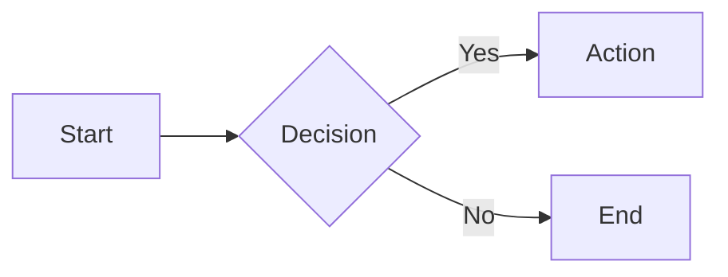
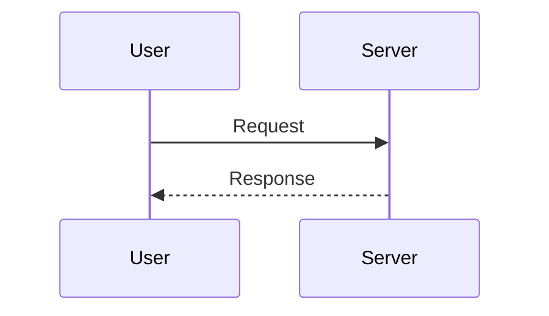
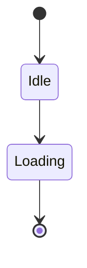
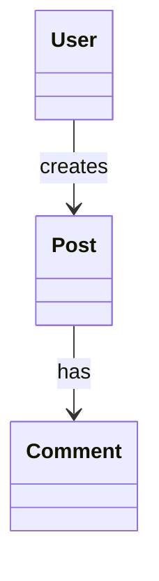
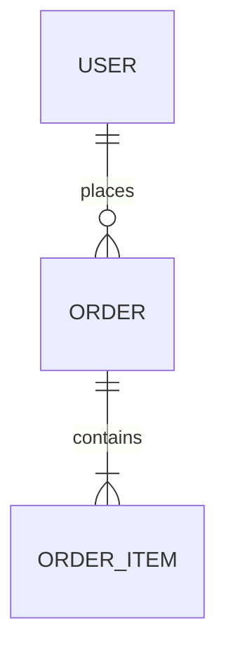

# Pretty Mermaid

Render professionally-styled Mermaid diagrams with curated themes. Supports SVG and PNG (via Puppeteer) for web/docs, and ASCII for terminals.

**Skill root**: `C:\Users\matti\.claude\skills\pretty-mermaid`

All script paths below use `SKILL_ROOT` as shorthand for the skill root directory. In every `node` command, replace `SKILL_ROOT` with the absolute path above.

**Prerequisite**: `@mermaid-js/mermaid-cli` must be installed globally (`npm install -g @mermaid-js/mermaid-cli`).

## Quick Start

### Render a Single Diagram

**SVG output:**
```bash
node "SKILL_ROOT/scripts/render.mjs" \
  --input diagram.mmd \
  --output diagram.svg \
  --theme tokyo-night
```

**PNG output:**
```bash
node "SKILL_ROOT/scripts/render.mjs" \
  --input diagram.mmd \
  --output diagram.png \
  --format png \
  --theme engineering \
  --scale 3
```

**From user-provided Mermaid code:**
1. Save the code to a `.mmd` file in the current working directory
2. Run the render script with desired theme

### Batch Render Multiple Diagrams

```bash
node "SKILL_ROOT/scripts/batch.mjs" \
  --input-dir ./diagrams \
  --output-dir ./output \
  --format svg \
  --theme dracula
```

### ASCII Output (Terminal-Friendly)

```bash
node "SKILL_ROOT/scripts/render.mjs" \
  --input diagram.mmd \
  --format ascii \
  --use-ascii
```

Note: ASCII output requires `beautiful-mermaid` (`cd SKILL_ROOT && npm install beautiful-mermaid`).

---

## Workflow Decision Tree

**Step 1: What does the user want?**
- **Render existing Mermaid code** -> Go to [Rendering](#rendering-diagrams)
- **Create new diagram** -> Go to [Creating](#creating-diagrams)
- **Apply/change theme** -> Go to [Theming](#theming)
- **Batch process** -> Go to [Batch Rendering](#batch-rendering)

**Step 2: Choose output format**
- **SVG** (web, docs, presentations) -> `--format svg` (default)
- **PNG** (slides, email, embedding) -> `--format png --scale 2`
- **ASCII** (terminal, logs, plain text) -> `--format ascii`

**Step 3: Select theme**
- **Engineering docs** -> `engineering` (white bg, black text, minimal)
- **Dark mode docs** -> `tokyo-night` (recommended dark)
- **Light mode docs** -> `github-light`
- **Vibrant colors** -> `dracula`
- **See all themes** -> Run `node "SKILL_ROOT/scripts/themes.mjs"`

---

## Rendering Diagrams

### From File

When user provides a `.mmd` file or Mermaid code block:

1. **Save to file** (if code block):
   ```bash
   cat > diagram.mmd << 'EOF'
   flowchart LR
       A[Start] --> B[End]
   EOF
   ```

2. **Render with theme**:
   ```bash
   node "SKILL_ROOT/scripts/render.mjs" \
     --input diagram.mmd \
     --output diagram.svg \
     --theme tokyo-night
   ```

3. **Verify output**:
   - SVG: Open in browser or embed in docs
   - PNG: View in image viewer
   - ASCII: Display in terminal

### Output Formats

**SVG (Scalable Vector Graphics)**
- Best for: web pages, documentation, version control, manual editing in Inkscape/Illustrator
- Features: full color, transparency, scalable, Inter font, native SVG text (Inkscape-compatible)
- Usage: `--format svg --output diagram.svg`
- Note: SVG output is automatically post-processed to convert mermaid's `<foreignObject>` HTML elements to native SVG `<text>`, making all text editable in vector editors

**PNG (Portable Network Graphics)**
- Best for: slides, email, systems that don't render SVG
- Features: rasterized, configurable DPI via `--scale`
- Usage: `--format png --output diagram.png --scale 3`

**ASCII (Terminal Art)**
- Best for: terminal output, plain text logs, README files
- Requires: `beautiful-mermaid` npm package (optional dependency)
- Usage: `--format ascii` (prints to stdout)
- Options:
  - `--use-ascii` - pure ASCII (no Unicode box-drawing)
  - `--padding-x 5` - horizontal spacing
  - `--padding-y 5` - vertical spacing

### Advanced Options

**Custom Colors** (overrides theme):
```bash
node "SKILL_ROOT/scripts/render.mjs" \
  --input diagram.mmd \
  --bg "#1a1b26" \
  --fg "#a9b1d6" \
  --line "#7aa2f7" \
  --output custom.svg
```

**Transparent Background**:
```bash
node "SKILL_ROOT/scripts/render.mjs" \
  --input diagram.mmd \
  --transparent \
  --theme engineering \
  --output transparent.svg
```

**Custom Font**:
```bash
node "SKILL_ROOT/scripts/render.mjs" \
  --input diagram.mmd \
  --font "JetBrains Mono" \
  --output custom-font.svg
```

**High-DPI PNG**:
```bash
node "SKILL_ROOT/scripts/render.mjs" \
  --input diagram.mmd \
  --format png \
  --scale 4 \
  --theme engineering \
  --output hd-diagram.png
```

---

## Creating Diagrams

### Using Templates

**Step 1: List available templates**
```bash
ls "SKILL_ROOT/assets/example_diagrams/"
# flowchart.mmd  sequence.mmd  state.mmd  class.mmd  er.mmd
```

**Step 2: Copy and modify**
```bash
cp "SKILL_ROOT/assets/example_diagrams/flowchart.mmd" my-workflow.mmd
# Edit my-workflow.mmd with user requirements
```

**Step 3: Render**
```bash
node "SKILL_ROOT/scripts/render.mjs" \
  --input my-workflow.mmd \
  --output my-workflow.svg \
  --theme github-dark
```

### Diagram Type Reference

For detailed syntax and best practices, see [DIAGRAM_TYPES.md](references/DIAGRAM_TYPES.md).

**Quick reference:**

**Flowchart** - processes, workflows, decision trees


**Sequence** - API calls, interactions, message flows


**State** - application states, lifecycle, FSM


**Class** - object models, architecture, relationships


**ER** - database schema, data models


### From User Requirements

**Step 1: Identify diagram type**
- **Process/workflow** -> flowchart
- **API/interaction** -> sequence
- **States/lifecycle** -> state
- **Object model** -> class
- **Database** -> ER

**Step 2: Create diagram file**
```bash
cat > user-diagram.mmd << 'EOF'
# [Insert generated Mermaid code]
EOF
```

**Step 3: Render and iterate**
```bash
node "SKILL_ROOT/scripts/render.mjs" \
  --input user-diagram.mmd \
  --output preview.svg \
  --theme tokyo-night

# Review with user, edit diagram.mmd if needed, re-render
```

---

## Theming

### List Available Themes

```bash
node "SKILL_ROOT/scripts/themes.mjs"
```

### Theme Catalog

| Theme | Mode | Best for |
|-------|------|----------|
| `engineering` | light | technical reports, papers, printing |
| `github-light` | light | clean docs, READMEs |
| `github-dark` | dark | GitHub-hosted docs |
| `tokyo-night` | dark | developer docs, modern feel |
| `dracula` | dark | vibrant, high contrast |
| `catppuccin-mocha` | dark | warm, pastel aesthetic |
| `nord` | dark | cool, minimalist |
| `solarized-dark` | dark | proven readability |
| `one-dark` | dark | Atom editor aesthetic |

### Apply Theme to Diagram

```bash
node "SKILL_ROOT/scripts/render.mjs" \
  --input diagram.mmd \
  --output themed.svg \
  --theme tokyo-night
```

### Compare Themes

Render the same diagram with multiple themes:
```bash
for theme in tokyo-night dracula engineering github-dark; do
  node "SKILL_ROOT/scripts/render.mjs" \
    --input diagram.mmd \
    --output "diagram-${theme}.svg" \
    --theme "$theme"
done
```

### Adding Custom Themes

Create a JSON file in `SKILL_ROOT/assets/themes/<name>.json`:
```json
{
  "theme": "base",
  "themeVariables": {
    "background": "#ffffff",
    "primaryColor": "#f5f5f5",
    "primaryTextColor": "#1a1a1a",
    "primaryBorderColor": "#333333",
    "lineColor": "#1a1a1a",
    "secondaryColor": "#eeeeee",
    "tertiaryColor": "#f9f9f9",
    "textColor": "#1a1a1a",
    "mainBkg": "#f5f5f5",
    "nodeBorder": "#333333",
    "nodeTextColor": "#1a1a1a",
    "clusterBkg": "#fafafa",
    "clusterBorder": "#666666",
    "titleColor": "#000000",
    "edgeLabelBackground": "#ffffff",
    "fontFamily": "Inter, system-ui, sans-serif",
    "fontSize": "14px"
  },
  "flowchart": { "curve": "basis", "padding": 20 }
}
```

The theme is immediately available via `--theme <name>`.

---

## Batch Rendering

### Batch Render Directory

```bash
node "SKILL_ROOT/scripts/batch.mjs" \
  --input-dir ./diagrams \
  --output-dir ./rendered \
  --format svg \
  --theme tokyo-night
```

### Batch with Multiple Formats

```bash
# SVG for docs
node "SKILL_ROOT/scripts/batch.mjs" \
  --input-dir ./diagrams \
  --output-dir ./svg \
  --format svg \
  --theme github-dark

# PNG for slides
node "SKILL_ROOT/scripts/batch.mjs" \
  --input-dir ./diagrams \
  --output-dir ./png \
  --format png \
  --theme engineering \
  --scale 3
```

---

## Common Use Cases

### 1. Architecture Diagram for Documentation

```bash
node "SKILL_ROOT/scripts/render.mjs" \
  --input architecture.mmd \
  --output docs/architecture.svg \
  --theme github-dark
```

### 2. Engineering Report Figure

```bash
node "SKILL_ROOT/scripts/render.mjs" \
  --input system-flow.mmd \
  --output figures/system-flow.png \
  --format png \
  --theme engineering \
  --scale 3
```

### 3. Database Schema Visualization

```bash
node "SKILL_ROOT/scripts/render.mjs" \
  --input schema.mmd \
  --output database-schema.svg \
  --theme dracula
```

### 4. Terminal-Friendly Workflow

```bash
node "SKILL_ROOT/scripts/render.mjs" \
  --input workflow.mmd \
  --format ascii \
  --use-ascii > workflow.txt
```

### 5. Transparent Background for Embedding

```bash
node "SKILL_ROOT/scripts/render.mjs" \
  --input diagram.mmd \
  --transparent \
  --theme engineering \
  --output embedded.svg
```

---

## Troubleshooting

### mmdc Not Found
```
Error rendering diagram: spawnSync mmdc ENOENT
```
**Solution:**
```bash
npm install -g @mermaid-js/mermaid-cli
```

### Invalid Mermaid Syntax
```
Error: Parse error on line 3
```
**Solution:**
1. Validate syntax against [DIAGRAM_TYPES.md](references/DIAGRAM_TYPES.md)
2. Test on https://mermaid.live/
3. Check for common errors: missing spaces in `A --> B`, unclosed brackets, incorrect node shape syntax

### File Not Found
```
Error: Input file not found: diagram.mmd
```
**Solution:** verify file path is correct, use absolute path if needed

### Unknown Theme
```
Error: Unknown theme "my-theme". Available: ...
```
**Solution:** check `themes.mjs` output for valid names, or create a JSON config in `assets/themes/`

---

## Resources

### scripts/
- `render.mjs` - single diagram rendering (SVG, PNG, ASCII)
- `batch.mjs` - batch processing directory of .mmd files
- `themes.mjs` - list available themes with color previews

### references/
- `THEMES.md` - detailed theme reference with examples
- `DIAGRAM_TYPES.md` - comprehensive syntax guide for all diagram types

### assets/
- `themes/*.json` - mmdc theme configuration files (9 themes)
- `fonts.css` - Inter font injection for Puppeteer rendering
- `example_diagrams/*.mmd` - starter templates for each diagram type

---

## Tips & Best Practices

### Quality
- Use `engineering` theme for print/paper, `tokyo-night` or `github-dark` for screen
- Add `--transparent` for diagrams embedded in documents with their own background
- Use `--scale 3` or `--scale 4` for high-DPI PNG output

### Performance
- Batch render for 3+ diagrams (sequential processing, shared Puppeteer instance via mmdc)
- Keep diagrams under 50 nodes for fast rendering
- Use ASCII for quick previews before committing to themed output

### Workflow
1. Start with templates from `assets/example_diagrams/`
2. Iterate with user feedback
3. Apply theme last
4. Render both SVG (docs) and PNG (slides) if needed

### Accessibility
- Use high-contrast themes (`engineering`, `dracula`) for presentations
- Add text labels to all connections
- Avoid color-only information encoding

### Mandatory Visual QA Gate (BLOCKING)

After every PNG render, you MUST:

1. **Open the PNG** with the Read tool (multimodal vision) and verify:
   - All text renders correctly — no literal `\n` characters
   - `<br/>` produces actual line breaks (never use `\n` for line breaks in node labels)
   - Node shapes are correct, no syntax errors causing deformed boxes
   - No truncated or overlapping labels

2. **Check A4 readability**: if the diagram will be embedded in a Word document,
   it will span ~16 cm page width. Estimate whether node text would be legible
   at that scale (~8pt minimum). If the diagram has too many nodes or text is
   too small:
   - Split into multiple simpler diagrams
   - Reduce node count
   - Increase font size in the theme

3. **Only after passing both checks**, keep the PNG. Otherwise fix the .mmd
   source and re-render.

This gate is non-negotiable. Prior failures: `\n` instead of `<br/>` rendered
as literal text, diagrams too complex to read at page width, visual errors
undetected because the agent never opened the rendered PNG.
